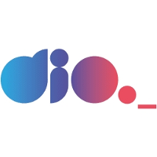
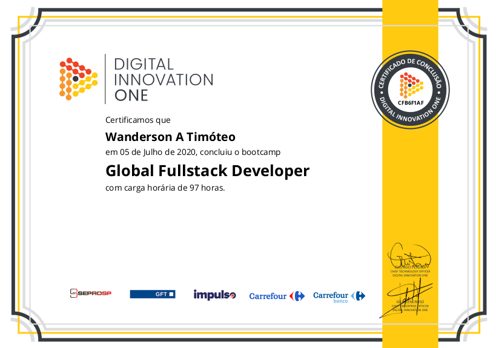

<h1 align="center">
  
  Global FullStack Developer
</h1>

  <a href="#-projeto">Projeto</a>&nbsp;&nbsp;&nbsp;|&nbsp;&nbsp;&nbsp;
  <a href="#-tecnologias">Tecnologias</a>&nbsp;&nbsp;&nbsp;|&nbsp;&nbsp;&nbsp;
  <a href="#-licença">Licença</a>&nbsp;&nbsp;&nbsp;|&nbsp;&nbsp;&nbsp;
  <a href="#-autor">Autor</a>

  

  
  
  

 

## 💻 Projeto

Bootcamp realizado pela plataforma de ensino Digital Innovation One.
 
Neste o aluno aprende desde o princípio básico a programar nas mais requisitadas linguagens de programação da atualidade.
 

### Certificado de conclusão

    

 

## 🚀 Tecnologias Estudadas

Esse projeto foi desenvolvido com as seguintes tecnologias e ferramentas:

- [HTML5](https://www.w3schools.com/html/)
- [CSS3](https://www.w3schools.com/css/default.asp)
- [Bootstrap](https://getbootstrap.com/)
- [Javascript](https://developer.mozilla.org/pt-BR/docs/Web/JavaScript)
- [React.js](https://developer.mozilla.org/pt-BR/docs/Web/JavaScript)
- [Node.js](https://developer.mozilla.org/pt-BR/docs/Web/JavaScript)
- [Python](https://www.python.org/)
- [PostgreSQL](https://www.postgresql.org/)
- [jQuery](https://jquery.com/)

 

## 🚩 Tenho Dúvidas... O que fazer?

Caso tenha dúvidas sobre o código do projeto, sintam-se a vontade em abrir uma **[ISSUE AQUI](https://github.com/Wanderson-A-Timoteo/Global-Fullstack-Developer/issues)**. Assim que possível, responderei todas as dúvidas!

 

## 💡 Licença

Esse projeto está sob a licença MIT. Veja o arquivo [LICENSE](github/LICENSE.md) para mais detalhes.

 

## 🎆 Autor

Feito com ♥ by

-  [**Wanderson A. Timóteo**](https://www.wandersontimoteo.com.br)

 

## 🤝 Agradecimentos

  

 

- Projeto desenvolvido durante o ` Bootcamp Global Fullstack Developer ` da plataforma de Ensino [DIO - Digital Innovation One](https://dio.me/).
